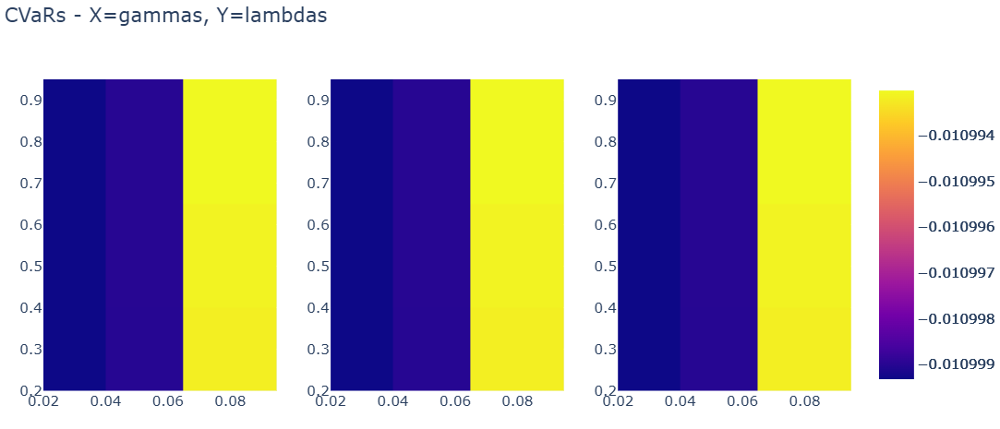
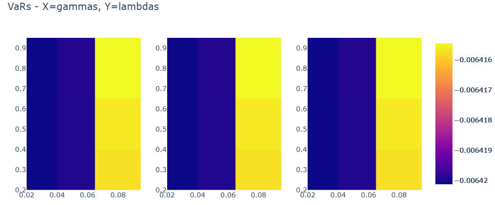
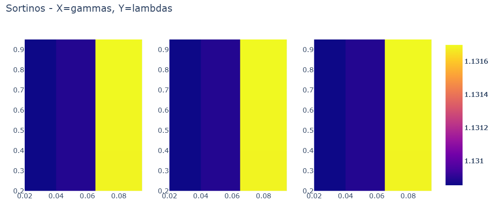
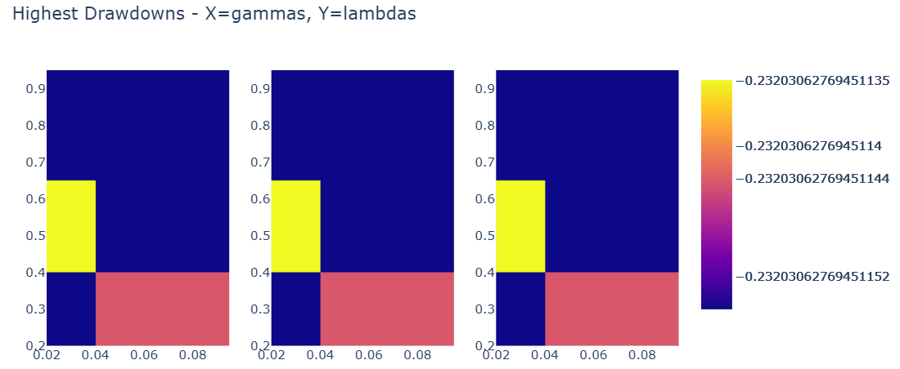
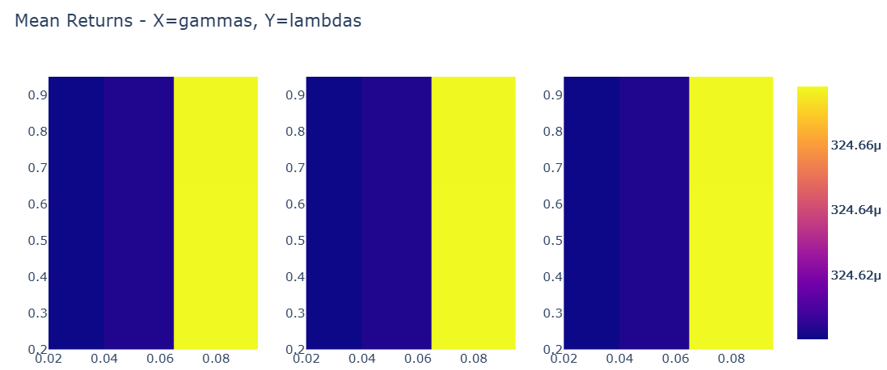

## Parameter fitting and testing

In this section we test out the selection of parameters used in the strategy.
We choose a range of parameter configurations, run the optimalization procedure and plot out, by using a heatmap, the resulting statistics for each configuraion.

```
lambdas = [0.3, 0.5, 0.8]  # CVaR penalty
gammas = [0.03, 0.05, 0.08] # weight concentration penalty
taus = [0.25, 0.5, 0.75] # turnover penalty
```












## Key Findings: Parameter Robustness

We observe that performance varies by less than 0.1% Sharpe across 27 parameter combinations.

This means that the strategy has a flat, robust solution surface. Market signals greatly outweight parameter sensitivity.