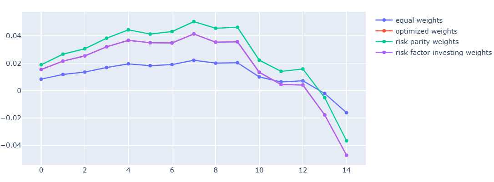
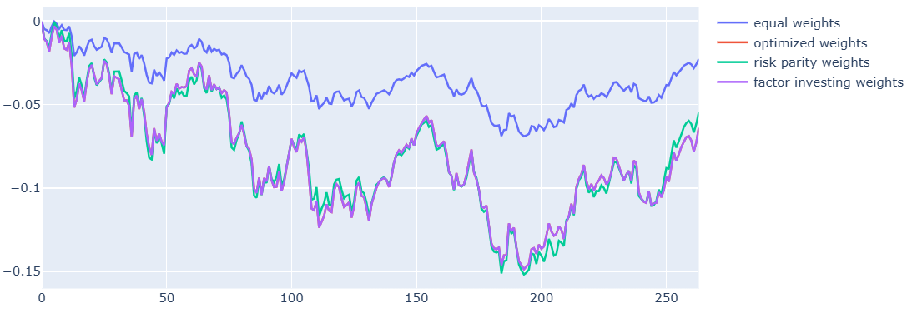
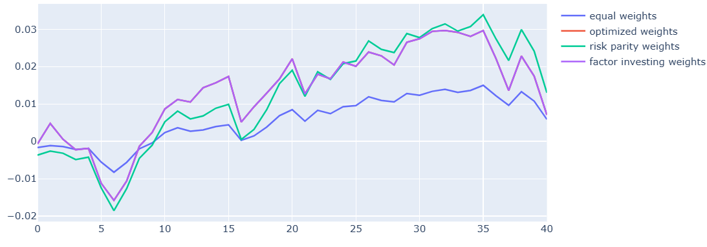

## Bear market performance and analysis

In this section we pick out some historical bear market time periods and test the main portfolio strategy and compare it to some other strategies.

<h2>Test 1: 2019-10-01 to 2020-03-01 (Covid)</h2>

```
Chosen weights:
Std. weights: [0.05555581, 0.05555581, 0.05555581, 0.05555581, 0.05555581, 0.05555581, 0.05555581, 0.61110934]
Factor investing: [0.31712806, 0.07720955, 0.07720955, 0.07720955, 0.07720955, 0.07720955, 0.07720955, 0.21961464]
Risk parity: [0.31713158, 0.07720915, 0.07720915, 0.07720915, 0.07720915, 0.07720915, 0.07720915, 0.2196135]
```

<table border="1" style="border-collapse: collapse; width: 100%; margin-bottom: 20px;">
  <thead>
    <tr>
      <th>Metric</th>
      <th>Optimized Weights</th>
      <th>Factor Investing Weights</th>
      <th>Equal Weights</th>
      <th>Risk Parity</th>
    </tr>
  </thead>
  <tbody>
    <tr>
      <td><strong>Var</strong></td>
      <td>-0.021689452</td>
      <td>-0.021689385</td>
      <td>-0.009783054509689217</td>
      <td>-0.02201177228372069</td>
    </tr>
    <tr>
      <td><strong>CVaR</strong></td>
      <td>-0.025869552</td>
      <td>-0.025869478</td>
      <td>-0.012141480218090986</td>
      <td>-0.027318205932842975</td>
    </tr>
    <tr>
      <td><strong>Sharpe</strong></td>
      <td>-4.305883387338538</td>
      <td>-4.3058660869515935</td>
      <td>-3.271080110105687</td>
      <td>-3.0905770810038615</td>
    </tr>
    <tr>
      <td><strong>Sortino</strong></td>
      <td>-4.817124449957003</td>
      <td>-4.81710499564439</td>
      <td>-4.012760189134961</td>
      <td>-3.791330158436424</td>
    </tr>
    <tr>
      <td><strong>Mean Return</strong></td>
      <td>-0.0031441017</td>
      <td>-0.0031440821</td>
      <td>-0.001066794592077911</td>
      <td>-0.0024002768880687403</td>
    </tr>
    <tr>
      <td><strong>Max Drawdown</strong></td>
      <td>-0.10968347</td>
      <td>-0.10968339</td>
      <td>-0.10527719</td>
      <td>-0.10527719</td>
    </tr>
  </tbody>
</table>



<h2>Test 2: 2021-02-22 to 2023-01-23</h2>

Observation: all active strategies concentrate heavily in US equities (28-32%) + gold (22%) due to the previous momentum. This leads to worse performance than equal weights during the March 2020 reversal.

Reason that this happens: momentum strategies suffer "momentum crashes" when recent winners reverse sharply. Equal weights provides better diversification.

```
Chosen weights:
Std. weights: [0.05555582, 0.05555582, 0.05555582, 0.05555582, 0.05555582, 0.05555582, 0.05555582, 0.61110926]
Factor investing: [0.28344768, 0.08130426, 0.08130426, 0.08130426, 0.08130426, 0.08130426, 0.08130426, 0.22872671]
Risk parity: [0.28343034, 0.08130623, 0.08130623, 0.08130623, 0.08130623, 0.08130623, 0.08130623, 0.22873227]
```

<table border="1" style="border-collapse: collapse; width: 100%; margin-bottom: 20px;">
  <thead>
    <tr>
      <th>Metric</th>
      <th>Optimized Weights</th>
      <th>Factor Investing Weights</th>
      <th>Equal Weights</th>
      <th>Risk Parity</th>
    </tr>
  </thead>
  <tbody>
    <tr>
      <td><strong>Var</strong></td>
      <td>-0.009604997</td>
      <td>-0.009605173</td>
      <td>-0.004427317925649577</td>
      <td>-0.00996141798785949</td>
    </tr>
    <tr>
      <td><strong>CVaR</strong></td>
      <td>-0.014319231</td>
      <td>-0.0143194785</td>
      <td>-0.006468058642165958</td>
      <td>-0.01455306277674845</td>
    </tr>
    <tr>
      <td><strong>Sharpe</strong></td>
      <td>-0.6888758765476396</td>
      <td>-0.6888790334975917</td>
      <td>-0.8769276358837523</td>
      <td>-0.5864910182297333</td>
    </tr>
    <tr>
      <td><strong>Sortino</strong></td>
      <td>-1.0765247829643232</td>
      <td>-1.0765300065953394</td>
      <td>-1.3620752481604324</td>
      <td>-0.9109587456370521</td>
    </tr>
    <tr>
      <td><strong>Mean Return</strong></td>
      <td>-0.00021940732</td>
      <td>-0.00021941445</td>
      <td>-7.969484073316845e-05</td>
      <td>-0.00017931253940894798</td>
    </tr>
    <tr>
      <td><strong>Max Drawdown</strong></td>
      <td>-0.16930733</td>
      <td>-0.16930845</td>
      <td>-0.15853415</td>
      <td>-0.15853415</td>
    </tr>
  </tbody>
</table>




<h2>Test 3: 2024-07-01 to 2025-03-01</h2>

```
# Chosen weights
Std. weights: [0.05555582, 0.05555582, 0.05555582, 0.05555582, 0.05555582, 0.05555582, 0.05555582, 0.61110928]
Factor investing: [0.38468137, 0.06971874, 0.06971874, 0.06971874, 0.06971874, 0.06971874, 0.06971874, 0.19700618]
Risk parity: [0.38463607, 0.06972388, 0.06972388, 0.06972388, 0.06972388, 0.06972388, 0.06972388, 0.1970207]
```

<table border="1" style="border-collapse: collapse; width: 100%; margin-bottom: 20px;">
  <thead>
    <tr>
      <th>Metric</th>
      <th>Optimized Weights</th>
      <th>Factor Investing Weights</th>
      <th>Equal Weights</th>
      <th>Risk Parity</th>
    </tr>
  </thead>
  <tbody>
    <tr>
      <td><strong>Var</strong></td>
      <td>-0.008340887</td>
      <td>-0.008341486</td>
      <td>-0.0027692063937795833</td>
      <td>-0.006230685061767105</td>
    </tr>
    <tr>
      <td><strong>CVaR</strong></td>
      <td>-0.009811683</td>
      <td>-0.0098121865</td>
      <td>-0.0036899366056665508</td>
      <td>-0.008302318288531355</td>
    </tr>
    <tr>
      <td><strong>Sharpe</strong></td>
      <td>0.20754405518563918</td>
      <td>0.20749481230109554</td>
      <td>0.2039633728809923</td>
      <td>0.6910181005169675</td>
    </tr>
    <tr>
      <td><strong>Sortino</strong></td>
      <td>0.2856444085569522</td>
      <td>0.28557346207458106</td>
      <td>0.31553485667207853</td>
      <td>1.0690169231102808</td>
    </tr>
    <tr>
      <td><strong>Mean Return</strong></td>
      <td>0.00018517459</td>
      <td>0.0001851617</td>
      <td>0.00014501747215646887</td>
      <td>0.0003262877767038902</td>
    </tr>
    <tr>
      <td><strong>Max Drawdown</strong></td>
      <td>-0.01568851</td>
      <td>-0.01568859</td>
      <td>-0.0152545</td>
      <td>-0.0152545</td>
    </tr>
  </tbody>
</table>



## Stress Test Summary

| Period | Opt Sharpe | Equal Weight | Edge |
|--------|------------|--------------|------|
| COVID Crash | -4.31 | -3.27 | ❌ Underperforms |
| 2022 Bear | -0.69 | -0.88 | ✅ Outperforms |
| 2024 Bear | +0.21 | +0.20 | ✅ Slight edge |

**Conclusion**: Strategy **enhances normal periods** but **suffers classic momentum crash behavior**. Safety mechanisms cap losses close to equal weight.